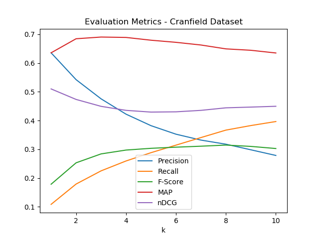

Results
First order softmax results
Precision, Recall and F-score @ 1 : 0.6355555555555555, 0.10863842569920996, 0.17862054033508964
MAP, nDCG @ 1 : 0.6355555555555555, 0.51
Precision, Recall and F-score @ 2 : 0.5422222222222223, 0.17919944968182408, 0.25304279472608676
MAP, nDCG @ 2 : 0.6844444444444444, 0.4734420841470045
Precision, Recall and F-score @ 3 : 0.4755555555555557, 0.2250368877598408, 0.2840343535494316
MAP, nDCG @ 3 : 0.6903703703703705, 0.4494096023950168
Precision, Recall and F-score @ 4 : 0.4222222222222222, 0.25944682482150194, 0.29739515240579767
MAP, nDCG @ 4 : 0.6890123456790125, 0.43544155393112244
Precision, Recall and F-score @ 5 : 0.38222222222222246, 0.28830694390969125, 0.3034856838511051
MAP, nDCG @ 5 : 0.6793703703703704, 0.42943744065767936
Precision, Recall and F-score @ 6 : 0.3525925925925925, 0.3145310734475464, 0.3074291599512377
MAP, nDCG @ 6 : 0.6720000000000004, 0.43036038214924927
Precision, Recall and F-score @ 7 : 0.33206349206349217, 0.3408497136930398, 0.3108281371700362
MAP, nDCG @ 7 : 0.6626961199294533, 0.4354335214983649
Precision, Recall and F-score @ 8 : 0.31777777777777777, 0.3667840931738801, 0.3147215493870735
MAP, nDCG @ 8 : 0.6492459813555052, 0.44426184720929063
Precision, Recall and F-score @ 9 : 0.298271604938272, 0.3826238640554465, 0.3101034366097937
MAP, nDCG @ 9 : 0.6443545036533134, 0.44683050927855344
Precision, Recall and F-score @ 10 : 0.2786666666666669, 0.3965928536714949, 0.30274895926150797
MAP, nDCG @ 10 : 0.634960243974133, 0.4496184053328144

