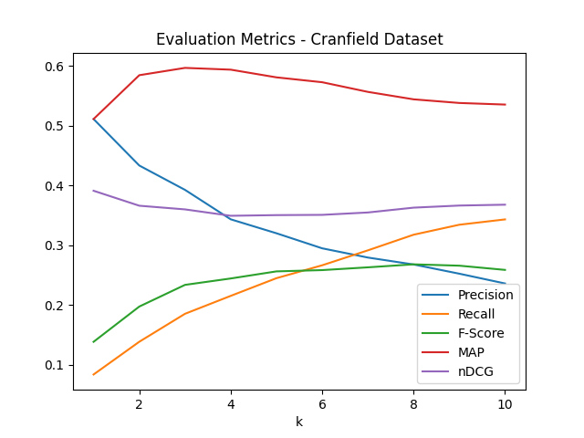

Baseline: 
$$CFW = log\frac{N}{n_i}$$
Results:

k & Precision@k & Recall@k & Fscore@k & mAP@k & nDCG@k \\
1 & 0.5111111111111111 & 0.08371644463017013 & 0.13840810716187216 & 0.5111111111111111 & 0.39111111111111113\\
2 & 0.43333333333333335 & 0.13848929609654131 & 0.19737092575494045 & 0.5844444444444444 & 0.3660759020679961\\
3 & 0.39259259259259266 & 0.18526727148764457 & 0.23364870353225572 & 0.5966666666666665 & 0.3599359785917866\\
4 & 0.3433333333333333 & 0.21525224947262256 & 0.24435811645630362 & 0.5937037037037035 & 0.34924323913622163\\
5 & 0.3200000000000004 & 0.24485221798631648 & 0.2562238627077565 & 0.5808333333333332 & 0.3503555819538245\\
6 & 0.29481481481481464 & 0.2664095292424108 & 0.25835328538954316 & 0.5726901234567902 & 0.35078200047174396\\
7 & 0.2793650793650794 & 0.29141272794439244 & 0.26299759114432414 & 0.5565305114638448 & 0.35477047755809343\\
8 & 0.2677777777777778 & 0.3175649641384243 & 0.268008732013053 & 0.5440599143361049 & 0.3628484457954403\\
9 & 0.2523456790123459 & 0.3342606118954756 & 0.26576209937094264 & 0.5379723356009072 & 0.36636505459581536\\
10 & 0.2359999999999999 & 0.3431742414757719 & 0.2586966033122466 & 0.5353174561182499 & 0.3677957470775602\\

k & Precision@k & Recall@k & Fscore@k & mAP@k & nDCG@k \\
1 & 0.1504424778761062 & 0.024248809204561416 & 0.03999029485755149 & 0.1504424778761062 & 0.11283185840707964\\
2 & 0.1592920353982301 & 0.04680410543242401 & 0.0685917487668161 & 0.2079646017699115 & 0.12744212581571163\\
3 & 0.13274336283185845 & 0.05514829320139054 & 0.07354919187752137 & 0.23156342182890857 & 0.11724272341785448\\
4 & 0.13053097345132744 & 0.06742831897699153 & 0.08342796464580624 & 0.24188790560471976 & 0.1183348618910877\\
5 & 0.13982300884955748 & 0.08947995220119109 & 0.10199624339565713 & 0.25294985250737456 & 0.12958903932083896\\
6 & 0.13716814159292037 & 0.10674475836500819 & 0.11211791512264305 & 0.24670599803343168 & 0.13828205290962284\\
7 & 0.1314791403286979 & 0.1200123572130339 & 0.11706935719901958 & 0.24760851243152127 & 0.14030517972625484\\
8 & 0.13163716814159293 & 0.14054068129282513 & 0.12565108435158104 & 0.24559067284731004 & 0.147512419419645\\
9 & 0.13176007866273343 & 0.1593211879051902 & 0.13413667942311708 & 0.24466357634499228 & 0.1554351952897894\\
10 & 0.127433628318584 & 0.17034095002351804 & 0.1355393171092445 & 0.24574167720185416 & 0.16023106437603363\\

![Graph] (output/eval_plot.png)
